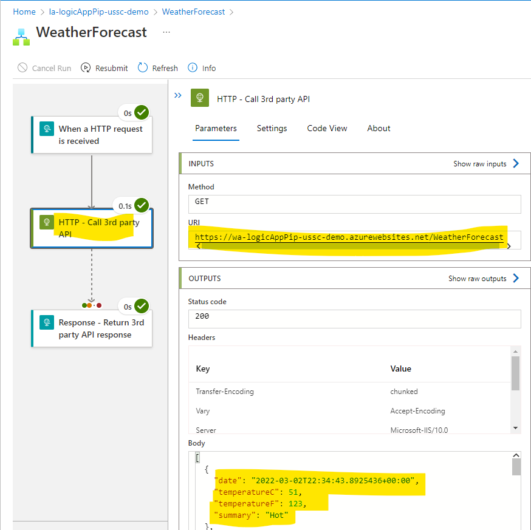

# logic-app-pip

This demo uses an Azure [Logic App Standard](https://docs.microsoft.com/en-us/azure/logic-apps/single-tenant-overview-compare) that calls an external API that has [IP whitelisting restrictions](https://docs.microsoft.com/en-us/azure/app-service/app-service-ip-restrictions) around it. It shows how to associate your Logic App with a [Virtual Network](https://docs.microsoft.com/en-us/azure/logic-apps/secure-single-tenant-workflow-virtual-network-private-endpoint) so you can control the Internet egress and predict what the outbound IP will be. The external API wants to whitelist the IP ranges that are allowed to call it to improve security beyond what an API key can provide. This example uses a [NAT Gateway](https://docs.microsoft.com/en-us/azure/virtual-network/nat-gateway/nat-overview) associated with the vNet to ensure all outbound traffic egresses through the static Public IP address and not from the multi-tenant service that hosts Logic Apps (which has a large CIDR range rather than a single IP address to whitelist on the 3rd party API).


The most important part of this design is associating the `Logic App` with the `Virtual Network`. In the past, you had to deploy an [Logic App ISE](https://docs.microsoft.com/en-us/azure/logic-apps/connect-virtual-network-vnet-isolated-environment) to get the vNet integration, but you can now do this with [Logic App Standard](https://docs.microsoft.com/en-us/azure/logic-apps/secure-single-tenant-workflow-virtual-network-private-endpoint#set-up-outbound-traffic-using-vnet-integration).

You can see this association in the Azure portal.

Navigate to the `Networking` blade. You can see that `VNet integration` is enabled for outbound traffic.


On the `VNet Integration` page, you can see that all traffic is routed through the vNet and the vNet association details (like which virtual network and which subnet).


## Disclaimer

**THE SOFTWARE IS PROVIDED "AS IS", WITHOUT WARRANTY OF ANY KIND, EXPRESS OR IMPLIED, INCLUDING BUT NOT LIMITED TO THE WARRANTIES OF MERCHANTABILITY, FITNESS FOR A PARTICULAR PURPOSE AND NONINFRINGEMENT. IN NO EVENT SHALL THE AUTHORS OR COPYRIGHT HOLDERS BE LIABLE FOR ANY CLAIM, DAMAGES OR OTHER LIABILITY, WHETHER IN AN ACTION OF CONTRACT, TORT OR OTHERWISE, ARISING FROM, OUT OF OR IN CONNECTION WITH THE SOFTWARE OR THE USE OR OTHER DEALINGS IN THE SOFTWARE.**

## Prerequisites

Install the following prerequisites.

- [Azure CLI](https://docs.microsoft.com/en-us/cli/azure/)
- [Dotnet CLI & .NET 6](https://docs.microsoft.com/en-us/dotnet/core/tools/)
- [PowerShell](https://docs.microsoft.com/en-us/powershell/scripting/install/installing-powershell-on-windows?view=powershell-7.2)
    - Alternatively, you can other methods to zip up the Logic App directory

## Deployment

1.  Clone the GitHub repo.

1.  Build the application locally to ensure it works

    ```shell
    cd web-api
    dotnet run
    ```

    Test the API locally to ensure you can call it

    ```shell
    curl http://localhost:5138/WeatherForecast -L -k
    ```

    You should see JSON data returned.

    ```shell
    [{"date":"2022-02-25T06:51:03.8986759-06:00","temperatureC":14,"temperatureF":57,"summary":"Balmy"},{"date":"2022-02-26T06:51:03.8986863-06:00","temperatureC":15,"temperatureF":58,"summary":"Scorching"},{"date":"2022-02-27T06:51:03.8986867-06:00","temperatureC":-19,"temperatureF":-2,"summary":"Chilly"},{"date":"2022-02-28T06:51:03.898687-06:00","temperatureC":17,"temperatureF":62,"summary":"Cool"},{"date":"2022-03-01T06:51:03.8986873-06:00","temperatureC":-1,"temperatureF":31,"summary":"Hot"}]
    ```
1.  Execute the `infra/main.bicep` file to deploy the required Azure infrastructure

    ```shell
    cd infra
    az login
    az deployment group create --resource-group rg-logicAppPip-ussc-demo --template-file ./main.bicep --parameters ./parameters.json --output yamlc --query properties.outputs
    ```

    Output
    ```yaml
    logicAppName:
      type: String
      value: la-logicAppPip-ussc-demo
    logicAppUrl:
      type: String
      value: la-logicapppip-ussc-demo.azurewebsites.net
    webApiName:
      type: String
      value: wa-logicAppPip-ussc-demo
    webApiUrl:
      type: String
      value: wa-logicapppip-ussc-demo.azurewebsites.net
    ```

1.  Deploy the `web-api` to the Azure App Service

    ```shell
    cd ../web-api
    az webapp deployment source config-local-git --resource-group rg-logicAppPip-ussc-demo --name wa-logicAppPip-ussc-demo
    ```

    Output
    ```shell
    {
      "url": "https://dwightSchruteAdmin@wa-logicapppip-ussc-demo.scm.azurewebsites.net/wa-logicAppPip-ussc-demo.git"
    }
    ```

    ```shell
    git remote add --master main azure https://dwightSchruteAdmin@wa-logicapppip-ussc-demo.scm.azurewebsites.net/wa-logicAppPip-ussc-demo.git
    git push azure main:master
    ```

1.  Modify the Logic App Workflow to call the API that is hosted on your new App Service.

    1.  Open the `./logic-app/WeatherForecast/workflow.json` file
    1.  Modify the URL of the `HTTP_-_Call_3rd_party_API` action to match the App Service you deployed (around line 8).

    ```shell
    "uri": "https://wa-logicAppPip-ussc-demo.azurewebsites.net/WeatherForecast"
    ```

1.  Deploy the `logic-app` workflow to the Azure Logic App service.

    ```shell
    Compress-Archive -Path .\logic-app\* -DestinationPath .\logic-app.zip
    az logicapp deployment source config-zip --resource-group rg-logicAppPip-ussc-demo --name la-logicAppPip-ussc-demo --src logic-app.zip
    ```

## Execute

You will run this test 2 times, once without an IP whitelisting rule that allows traffic from the Logic App to prove that requests coming from non-approved IP ranges are disallowed.

You can then run the test again by adding a rule to the IP restrictions on the App Service and seeing that the Logic App runs to completion successfully.

Get the trigger callback URL from the Azure portal.

1.  Navigate to your Logic App in the [Azure portal](https://portal.azure.com)
1.  Click on `Workflows`
1.  Click on the `WeatherForecast` trigger
1.  Copy the `Workflow URL`

Example:

```
https://la-logicapppip-ussc-demo.azurewebsites.net:443/api/WeatherForecast/triggers/manual/invoke?api-version=2020-05-01-preview&sp=%2Ftriggers%2Fmanual%2Frun&sv=1.0&sig=KyoeiMR0Fakekey45JeMC7BWRLHeQGOYeAXV4NAJg```
```

### Execute failed test (since IP whitelist doesn't allow IP address of Logic App)

```shell
curl "https://la-logicapppip-ussc-demo.azurewebsites.net:443/api/WeatherForecast/triggers/manual/invoke?api-version=2020-05-01-preview&sp=%2Ftriggers%2Fmanual%2Frun&sv=1.0&sig=KyoeiMR0Fakekey45JeMC7BWRLHeQGOYeAXV4NAJg"
```


### Execute successful test (since IP whitelist allows the IP address of Logic App)

#### Add the IP whitelisting rule
1.  Navigate to the `Public IP Address` that has been created in the `Resource Group`.
1.  On the `Overview` page, copy the `IP address`.
1.  Navigate to the App Service that has been deployed with the 3rd party API we want the Logic App to call (Example: `wa-logicAppPip-ussc-demo`).
1.  On the `Networking` blade, click on `Access restrictions`.
1.  Select the `Allow Logic App IP address` rule
1.  Change the `IP Address Block` to match the static IP address you provisioned earlier (the one the Logic App will use to communicate).
1.  Click `Update rule`

#### Execute the Logic App

Now you can call the HTTP endpoint for the Logic App and ensure that it can successfully connect to to the 3rd party API. The App Service IP restriction firewall ensures that requests can only come from the Logic App's Public IP address.

##### Calling the 3rd party API directly from your local machine (which will fail since the IP address of your computer will not be whitelisted)

```shell
curl "https://wa-logicAppPip-ussc-demo.azurewebsites.net/WeatherForecast"  -L -k
```

##### Calilng the 3rd party API by calling the Logic App (which will call the 3rd party API via its static IP address)

```shell
curl "https://la-logicapppip-ussc-demo.azurewebsites.net:443/api/WeatherForecast/triggers/manual/invoke?api-version=2020-05-01-preview&sp=%2Ftriggers%2Fmanual%2Frun&sv=1.0&sig=KyoeiMR0Fakekey45JeMC7BWRLHeQGOYeAXV4NAJg"  -L -k
```

```shell
[{"date":"2022-03-02T22:34:43.8925436+00:00","temperatureC":51,"temperatureF":123,"summary":"Hot"},{"date":"2022-03-03T22:34:43.8925833+00:00","temperatureC":6,"temperatureF":42,"summary":"Hot"},{"date":"2022-03-04T22:34:43.8925836+00:00","temperatureC":47,"temperatureF":116,"summary":"Scorching"},{"date":"2022-03-05T22:34:43.8925839+00:00","temperatureC":-4,"temperatureF":25,"summary":"Bracing"},{"date":"2022-03-06T22:34:43.8925841+00:00","temperatureC":40,"temperatureF":103,"summary":"Scorching"}]
```

You can also see that this command succeded in the Logic App Workflow logs.



## Links

- [Logic App Standard](https://docs.microsoft.com/en-us/azure/logic-apps/single-tenant-overview-compare#stateful-and-stateless-workflows)
- [NAT Gateway](https://docs.microsoft.com/en-us/azure/virtual-network/nat-gateway/nat-overview)
- [App Service access restrictions](https://docs.microsoft.com/en-us/azure/app-service/app-service-ip-restrictions)
